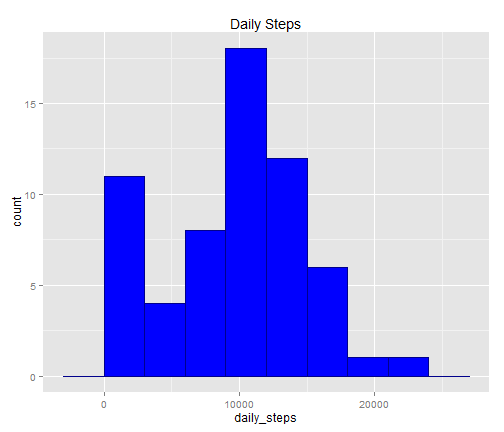

## Assigment 1

# load library and file


```r
library(ggplot2)
```

```
## Warning: package 'ggplot2' was built under R version 3.0.3
```

```r
library(chron)
```

```
## Warning: package 'chron' was built under R version 3.0.3
```

```r
library(scales)
```

```
## Warning: package 'scales' was built under R version 3.0.3
```

```r
library(reshape2)
```

```
## Warning: package 'reshape2' was built under R version 3.0.3
```

```r
# load datas 
files<-read.csv("activity.csv")
```

# transform data


```r
files$date <- as.Date(files$date, format = "%Y-%m-%d")

# remove the na data and select the columns and put all in a new variable

daily_steps<-tapply(files$steps,files$date,sum,na.rm=TRUE)
```

#  The graph  steps per day


```r
# Get a graphic with the mean, median 
dsf<-data.frame(daily_steps)
final_mean<-mean(daily_steps)
final_median<-median(daily_steps)
final_result<-as.data.frame(c(final_mean,final_median))
names(final_result)<-"par"
final_result$cat<-factor(c("mean","median"))

# with the ggplot2 utility create a graphic histogram
g<-ggplot(dsf,aes(x=daily_steps))
graphic_result<-g+geom_histogram(fill="blue",colour="darkblue",binwidth=3000)+
  labs(title = "Daily Steps")+
  scale_linetype_discrete(breaks=c("mean","median")) 
```


```r
print(graphic_result)
```

 


