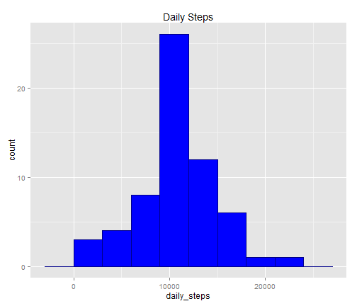

## Assigment 1

# load library and file


```r
library(ggplot2)
```

```
## Warning: package 'ggplot2' was built under R version 3.0.3
```

```r
library(chron)
```

```
## Warning: package 'chron' was built under R version 3.0.3
```

```r
library(scales)
```

```
## Warning: package 'scales' was built under R version 3.0.3
```

```r
library(reshape2)
```

```
## Warning: package 'reshape2' was built under R version 3.0.3
```

```r
# load datas 
files<-read.csv("activity.csv")
```

# transform data


```r
files$date <- as.Date(files$date, format = "%Y-%m-%d")

# remove the na data and select the columns and put all in a new variable

daily_steps<-tapply(files$steps,files$date,sum,na.rm=TRUE)
```

#  The graph  steps per day


```r
# Get a graphic with the mean, median 
dsf<-data.frame(daily_steps)
final_mean<-mean(daily_steps)
final_median<-median(daily_steps)
final_result<-as.data.frame(c(final_mean,final_median))
names(final_result)<-"par"
final_result$cat<-factor(c("mean","median"))

# with the ggplot2 utility create a graphic histogram
gp<-ggplot(dsf,aes(x=daily_steps))
graphic_result<-gp+geom_histogram(fill="blue",colour="darkblue",binwidth=3000)+
  labs(title = "Daily Steps")+
  scale_linetype_discrete(breaks=c("mean","median")) 
```


```r
print(graphic_result)
```

 
# Mean and Median


```r
cat("mean:",final_mean)
```

```
## mean: 9354
```

```r
cat("median:", final_median)
```

```
## median: 10395
```
# Average 5 minutes of steps

```r
interval_number_final<-0:(nrow(files)-1)
interval_final<-factor(interval_number_final%%288)
int_mean<-tapply(files$steps,interval_final,mean,na.rm=TRUE)
dimnames(int_mean)[[1]]<-NULL  ##to avoid confusions
int_mean_final<-as.data.frame(int_mean)
point0<-as.character(files$date[1])
point1<-as.POSIXlt(point0)
lines<-dim(int_mean_final)[1]
int_mean_final$times<-as.POSIXct(seq.POSIXt(from=point1,by="5 min",length.out=lines))
graph<-ggplot(int_mean_final,aes(x=times,y=int_mean))
graph_final<-graph+labs(title = "Average steps on 5 minute of intervals")+
geom_point(size=1)+
geom_line(size=.5,col="black")+
labs(x="time",y="number of steps")
```


```r
print(graph_final)
```

 
# maximun values

```r
max(int_mean_final$int_mean)
```

```
## [1] 206.2
```

# no null effects or missing values
## Exploratory analysis

```r
cat("values missing in files",table(is.na(files)))
```

```
## values missing in files 50400 2304
```

```r
cat("values misssing in steps",table(is.na(files$steps)))
```

```
## values misssing in steps 15264 2304
```

```r
cat("mean:",mean(is.na(files$steps)))
```

```
## mean: 0.1311
```

#  eliminate the null values in the graph

```r
files2<-files
nona<-which(is.na(files2$steps))
nona2<- nona%%288
files2$steps[nona]<-int_mean_final$int_mean[nona2]
```

```
## Warning: número de items para para sustituir no es un múltiplo de la
## longitud del reemplazo
```

```r
daily_steps<-tapply(files2$steps,files2$date,sum)
dsf<-data.frame(daily_steps)
final_mean<-mean(daily_steps)
final_median<-median(daily_steps)
final_result<-as.data.frame(c(final_mean,final_median))
names(final_result)<-"par"
final_result$cat<-factor(c("mean","median"))

# with the ggplot2 utility create a graphic histogram
gp<-ggplot(dsf,aes(x=daily_steps))
graphic_result_2<-gp+geom_histogram(fill="blue",colour="darkblue",binwidth=3000)+
labs(title = "Daily Steps")+
scale_linetype_discrete(breaks=c("mean","median")) 
```


```r
print(graphic_result_2)
```

 
# Mean and Median with the eliminate the missing values


```r
cat("mean:",final_mean)
```

```
## mean: 10766
```

```r
cat("median:", final_median)
```

```
## median: 10765
```

